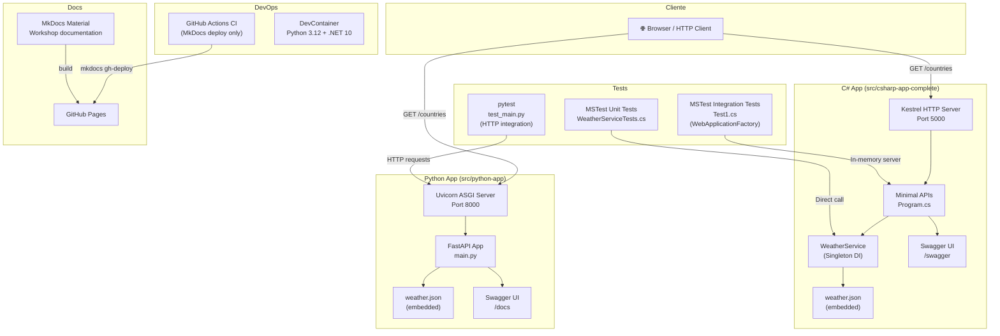

# 04 — Architecture

## Arquitectura Actual (As-Is)

El repositorio contiene **dos implementaciones equivalentes** de una API REST de clima:

1. **Python App** — la implementación original
2. **C# App** — la migración completada (resultado del workshop)

Ambas sirven la misma interfaz HTTP, leen el mismo dataset JSON estático y exponen documentación Swagger/OpenAPI.

---

## Diagrama de Arquitectura

> Ver [diagrams/architecture.mmd](diagrams/architecture.mmd) para el diagrama Mermaid completo.



---

## Flujos Principales

### Flujo 1: Consulta de países

```
Cliente → GET /countries → FastAPI/MinimalAPI → Lee keys de weather.json → Retorna ["England", "France", ...]
```

### Flujo 2: Consulta de temperatura

```
Cliente → GET /countries/Spain/Seville/January
  → FastAPI: data["Spain"]["Seville"]["January"] → {"high": 60, "low": 42}
  → MinimalAPI: WeatherService.TryGetMonthlyAverage("Spain","Seville","January") → TemperatureDto{High=60,Low=42}
```

### Flujo 3: Documentación (Swagger)

```
Cliente → GET / → Redirect 301/302 → /docs (Python) o /swagger (C#) → Swagger UI
```

---

## Patrón Arquitectónico

- **Monolito simple** (single-process API)
- **Sin base de datos** — datos embebidos en JSON
- **Sin servicios externos** — autónomo
- **Stateless** — no hay sesiones ni estado compartido
- **DI (solo C#)** — `WeatherService` registrado como Singleton

---

## Arquitectura Propuesta en Azure (To-Be)

```
                    ┌─────────────────────────────┐
                    │     Azure Resource Group     │
                    │   rg-demoaitourmxJJ          │
                    ├─────────────────────────────┤
                    │                             │
    ┌───────────────┼───────────────┐             │
    │ App Service Plan              │             │
    │ asp-demoaitourmxJJ (Linux/B1) │             │
    │   ┌─────────────────────┐     │    ┌────────┴───────┐
    │   │ App Service (Python)│     │    │ Key Vault      │
    │   │ app-..-python       │     │    │ kv-demoaitr..  │
    │   └─────────────────────┘     │    └────────────────┘
    │   ┌─────────────────────┐     │    ┌────────────────┐
    │   │ App Service (C#)    │     │    │ App Insights   │
    │   │ app-..-csharp       │     │    │ appi-demoai..  │
    │   └─────────────────────┘     │    └────────┬───────┘
    └───────────────────────────────┘             │
                                        ┌────────┴───────┐
                                        │ Log Analytics  │
                                        │ log-demoai..   │
                                        └────────────────┘
```

- **2 App Services** en un plan compartido Linux B1
- **Application Insights** para observabilidad
- **Key Vault** para secretos futuros
- **No se requiere** Container Registry, AKS ni Functions (apps simples, sin contenedores)
