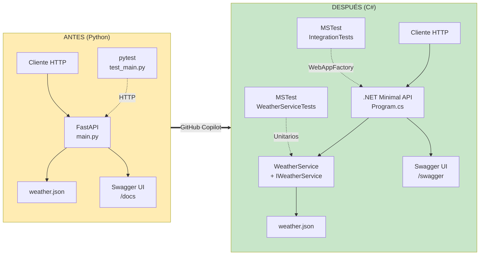

# Diagrama de Flujo del Laboratorio

## 🗺️ Vista General del Workshop

Este diagrama muestra la secuencia completa del laboratorio con las decisiones, modos de Copilot y entregables de cada paso.

---

## Diagrama Principal

```mermaid
flowchart TD
    START([🎬 Inicio del Workshop]) --> SETUP

    subgraph SETUP["🔧 FASE 0: Preparación (5 min)"]
        A1[Elegir entorno] --> A2{¿Codespaces<br/>o Local?}
        A2 -->|Codespaces| A3[Crear Codespace<br/>en GitHub]
        A2 -->|Local| A4[Clonar repo +<br/>instalar prerrequisitos]
        A3 --> A5[Verificar entorno]
        A4 --> A5
    end

    A5 --> EXPLORE

    subgraph EXPLORE["🔍 FASE 1: Explorar Python (10 min)"]
        B1[Abrir src/python-app/] --> B2[Leer main.py]
        B2 --> B3[Ejecutar app Python<br/>uvicorn main:app --port 8000]
        B3 --> B4[Probar 3 endpoints<br/>con curl]
        B4 --> B5[💬 Ask Mode: Analizar<br/>estructura y endpoints]
    end

    B5 --> ANALYZE

    subgraph ANALYZE["🧠 FASE 2: Estrategizar (10 min)"]
        C1[💬 Ask Mode: Crear<br/>estrategia de migración] --> C2[Aprender equivalencias<br/>Python → C#]
        C2 --> C3[🤖 Agent Mode: Identificar<br/>gaps en tests Python]
        C3 --> C4[Documentar findings]
    end

    C4 --> SCAFFOLD

    subgraph SCAFFOLD["🏗️ FASE 3: Scaffolding C# (15 min)"]
        D1[🤖 Agent: Crear<br/>MIGRATION_INSTRUCTIONS.md] --> D2[🤖 Agent: Crear proyecto<br/>dotnet new webapi]
        D2 --> D3[Verificar estructura:<br/>Models/ Services/ Program.cs]
        D3 --> D4[dotnet build ✅]
        D4 --> D5[🤖 Agent: Implementar<br/>primer endpoint GET /weather]
        D5 --> D6[Probar con curl ✅]
    end

    D6 --> MIGRATE

    subgraph MIGRATE["⚡ FASE 4: Migrar Endpoints (15 min)"]
        E1[🤖 Agent: GET /weather/city] --> E2[Probar + verificar ✅]
        E2 --> E3[🤖 Agent: GET /weather/city/month] --> E4[Probar + verificar ✅]
        E4 --> E5[Verificar Swagger UI ✅]
    end

    E5 --> VALIDATE

    subgraph VALIDATE["✅ FASE 5: Validar (10 min)"]
        F1[💬 Ask: Code review<br/>del proyecto C#] --> F2[Comparar respuestas<br/>Python vs C#]
        F2 --> F3{¿Respuestas<br/>idénticas?}
        F3 -->|Sí| F4[✅ Migración exitosa]
        F3 -->|No| F5[🤖 Agent: Fix<br/>diferencias]
        F5 --> F2
    end

    F4 --> TESTS

    subgraph TESTS["🧪 FASE 6: Tests C# (15 min)"]
        G1[🤖 Agent: Crear proyecto<br/>MSTest con tests] --> G2[dotnet test ✅]
        G2 --> G3{¿Todos<br/>pasan?}
        G3 -->|Sí| G4[✅ Tests completos]
        G3 -->|No| G5[🤖 Agent: Fix tests]
        G5 --> G2
    end

    G4 --> DONE([🎉 Workshop Completado])
    DONE --> BONUS

    subgraph BONUS["⭐ BONUS (si hay tiempo)"]
        H1[🐳 Reto 1: Docker] 
        H2[🗄️ Reto 2: EF Core]
        H3[☁️ Reto 3: Azure]
    end

    style START fill:#4CAF50,color:#fff
    style DONE fill:#4CAF50,color:#fff
    style SETUP fill:#E3F2FD
    style EXPLORE fill:#FFF3E0
    style ANALYZE fill:#F3E5F5
    style SCAFFOLD fill:#E8F5E9
    style MIGRATE fill:#FFF8E1
    style VALIDATE fill:#E0F7FA
    style TESTS fill:#FCE4EC
    style BONUS fill:#F5F5F5
```



---

## Tabla de Tiempos por Fase

| Fase | Duración | Modo Principal | Entregable |
|------|----------|---------------|------------|
| 0. Preparación | 5 min | — | Entorno listo |
| 1. Explorar Python | 10 min | 💬 Ask | Comprensión de la app |
| 2. Estrategizar | 10 min | 💬 Ask + 🤖 Agent | Estrategia de migración |
| 3. Scaffolding C# | 15 min | 🤖 Agent | Proyecto C# compilando + primer endpoint |
| 4. Migrar Endpoints | 15 min | 🤖 Agent | 3 endpoints funcionando |
| 5. Validar | 10 min | 💬 Ask | Equivalencia confirmada |
| 6. Tests | 15 min | 🤖 Agent | Tests pasando |
| **Total** | **~80 min** | | **App migrada y testeada** |

---

## Secuencia de Prompts por Fase

```
FASE 1 ─── Prompt 1.1 (💬 Analizar app Python)
              │
FASE 2 ─── Prompt 2.1 (💬 Estrategia de migración)
         └── Prompt 2.2 (🤖 Identificar gaps tests)
              │
FASE 3 ─── Prompt 3.1 (🤖 Crear instrucciones)
         └── Prompt 3.2 (🤖 Crear scaffolding)
         └── ⌨️  dotnet build
         └── Prompt 3.4 (🤖 Primer endpoint)
              │
FASE 4 ─── Prompt 4.1 (🤖 GET /weather/{city})
         └── Prompt 4.2 (🤖 GET /weather/{city}/{month})
              │
FASE 5 ─── Prompt 5.1 (💬 Code review)
         └── Prompt 5.2 (💬 Comparar APIs)
         └── ⌨️  diff side-by-side
              │
FASE 6 ─── Prompt 6.1 (🤖 Crear tests MSTest)
         └── ⌨️  dotnet test
         └── Prompt 6.3 (💬 Análisis cobertura)
```

---

## Diagrama de Arquitectura: Antes y Después



---

## Checklist de Progreso

Usa esta checklist para trackear tu avance durante el workshop:

- [ ] **Fase 0**: Entorno configurado y verificado
- [ ] **Fase 1**: App Python ejecutada y endpoints verificados
- [ ] **Fase 2**: Estrategia de migración documentada
- [ ] **Fase 3**: Scaffolding C# creado y compilando
- [ ] **Fase 3**: Primer endpoint (`GET /weather`) funcional
- [ ] **Fase 4**: Segundo endpoint (`GET /weather/{city}`) funcional
- [ ] **Fase 4**: Tercer endpoint (`GET /weather/{city}/{month}`) funcional
- [ ] **Fase 4**: Swagger UI funcionando
- [ ] **Fase 5**: Respuestas C# coinciden con Python
- [ ] **Fase 6**: Proyecto de tests creado
- [ ] **Fase 6**: Todos los tests pasan
- [ ] **Bonus**: Docker (opcional)
- [ ] **Bonus**: EF Core (opcional)
- [ ] **Bonus**: Azure (opcional)

---

**Volver a:** [Índice →](index.md) | [Guía de Prompts →](guia-prompts.md)
